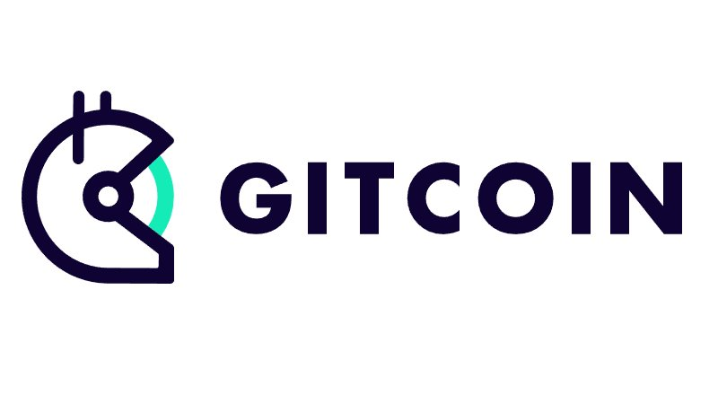

# lazy-etherscan

<div align="left">
    <a href="https://github.com/woxjro/lazy-etherscan/"></a>
    <a href="https://github.com/woxjro/lazy-etherscan/actions"></a>
    <a href="https://github.com/woxjro/lazy-etherscan/blob/master/LICENSE"></a>
</div>


<details>
 <summary><strong>Table of contents</strong></summary>
 <br/>

- [lazy-etherscan](#lazy-etherscan)
  - [Features](#features)
  - [Prerequisites](#prerequisites)
  - [Build](#build)
  - [Configurations & Usage](#configurations--usage)
  - [Roadmap](#roadmap)
  - [Contributing](#contributing)
  - [Sponsors](#sponsors)
  - [Acknowledgement](#acknowledgement)

<br/>
</details>

## Features
- **No Browser Required** - Use it effortlessly even in environments where browsers are unavailable, such as within servers.
- **Developer Friendly** - Operate efficiently using keyboard shortcuts.
- **Easily Switch Endpoints** - Switch between endpoints, including Mainnet, Testnets, custom node connections, and even BSC endpoints.

## Prerequisites
To see transactions' decoded input data, you have to preinstall [`ethereum-input-data-decoder`](https://github.com/miguelmota/ethereum-input-data-decoder). Please run the following command.
```sh
npm install -g ethereum-input-data-decoder
```

## Build
This software has been tested and verified to work correctly on the following operating systems:
- `Ubuntu 22.04.2 LTS`
- `macOS Ventura 13.2`

```sh
$ git clone https://github.com/woxjro/lazy-etherscan
$ cd lazy-etherscan
$ cargo run --
```

## Configurations & Usage
### Ethereum Statistics
To see statistics information about Ethereum, you have to set an Etherscan's free API key.
You can get it from [here](https://etherscan.io/apis).
And set it to `api_key` field in `settings.toml`. You can use a setting template file (`settings.example.toml`).
```sh
$ mv ./settings.example.toml ./settings.toml
```

### Configurations
Please check the various settings such as endpoints using the following command:
```sh
cargo run -- --help
```

### Usage
The basic usage is as follows:
- Press `q` to exit `lazy-etherscan`.
- Press `s` to focus on the search bar, where you can perform searches for addresses, blocks, transactions, and more.
- Press `1` to navigate the "Latest Blocks" panel. Use `j` to move to a block below and `k` to an above block.
    - Press `r` to refresh the "Latest Blocks".
- Press `2` to navigate the "Latest Transactions" panel. Use `j` to move to a transaction below and `k` to move to a transaction above.
    - Press `r` to refresh the "Latest Transactions".
- Press `<Ctrl+e>` to toggle the sidebar.
- Press `<Ctrl+p>` to move to a previous screen.

## Roadmap
Please see [this issue](https://github.com/woxjro/lazy-etherscan/issues/1).

## Contributing
This project is currently in the Proof of Concept (PoC) stage.
Contributions are kindly requested to be postponed until further notice.
Crash reports are welcome, please create an issue to do that.

## Sponsors
This project has been developed with a grant from the [Ethereum Foundation](https://ethereum.org/en/foundation/) and [Gitcoin](https://www.gitcoin.co/).



## Acknowledgement
`lazy-etherscan` is written in [Rust](https://www.rust-lang.org/) and is built on top of [ratatui](https://github.com/ratatui-org/ratatui).
This project is highly inspired by [Etherscan](https://etherscan.io/), [lazygit](https://github.com/jesseduffield/lazygit) and [spotify-tui](https://github.com/Rigellute/spotify-tui).
