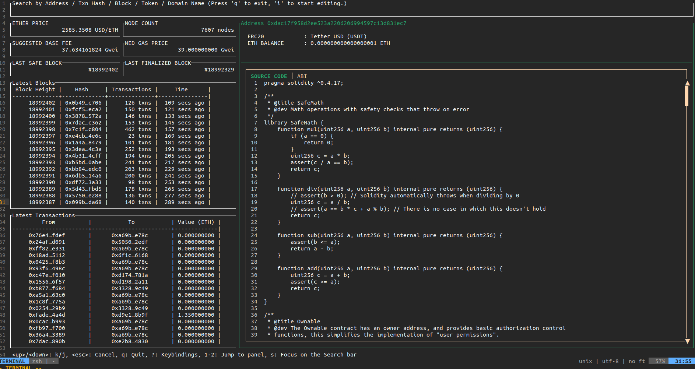
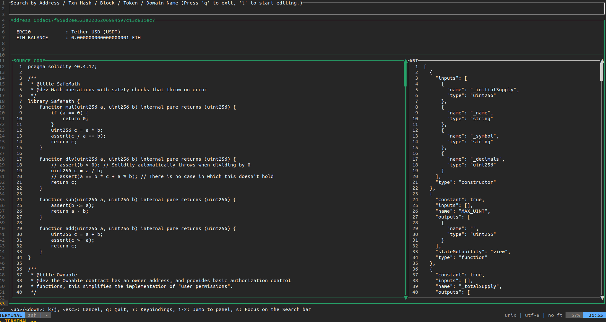
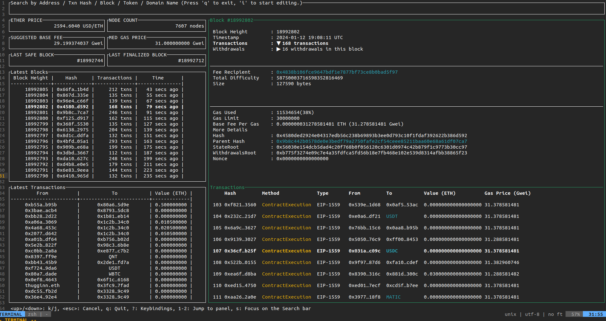
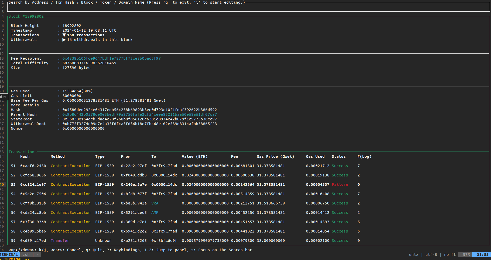

# Usage
The basic usage is as follows:
- Press `q` to exit `lazy-etherscan`.
- Press `s` to focus on the search bar. You can search by the following words.
    - Address
    - Block Number
    - ENS ID
    - Transaction Hash
    - Ticker Name (`USDT`, `BNB`,`UNI`, ...)
- Press `1` to navigate the `Latest Blocks` panel. Use `j` to move to a block below and `k` to an above block.
    - Press `r` to refresh the `Latest Blocks`.
- Press `2` to navigate the `Latest Transactions` panel. Use `j` to move to a transaction below and `k` to move to a transaction above.
    - Press `r` to refresh the `Latest Transactions`.
- Press `<Ctrl+e>` to toggle the sidebar.
- Press `<Ctrl+p>` to move to a previous screen.

## Examples

### Searching by Tickers

Here is an example of searching with `USDT`.

Press `s` to focus on the search bar. Then, press `i` to enter edit mode. Type `USDT` and press `Enter`.

On the search results screen, the left side displays the source code of the contract, and the right side shows the contract's ABI. You can navigate between them using the left and right arrow keys. Scroll through the focused elements using the `j`/`k` keys.

Additionally, you can toggle the sidebar by pressing `<Ctrl+e>`, allowing you to view both the source code and ABI simultaneously, as shown in the image below:

### Exploring a Block
Next, let's explore how to investigate blocks.

You can input the block number in the search bar or select it from the Latest Blocks pane to navigate to the Block Details screen.

Use `j`/`k` to navigate between selectable items such as `Transactions`, `Withdrawals`, `Fee Recipient`, and `Parent Hash`.

For example, selecting `Transactions` and pressing `Enter` will take you to a pane displaying a list of transactions in the block.

Moreover, pressing `<Ctrl+e>` toggles the sidebar, revealing more detailed information about the transaction list.

